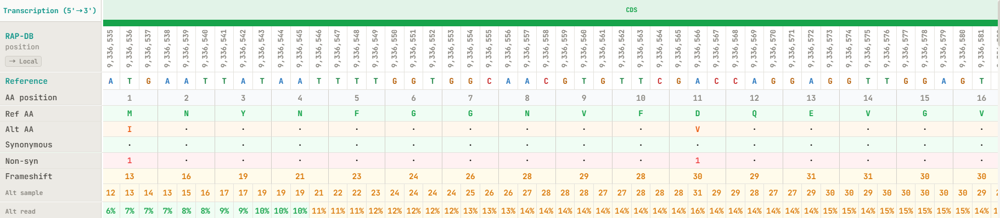
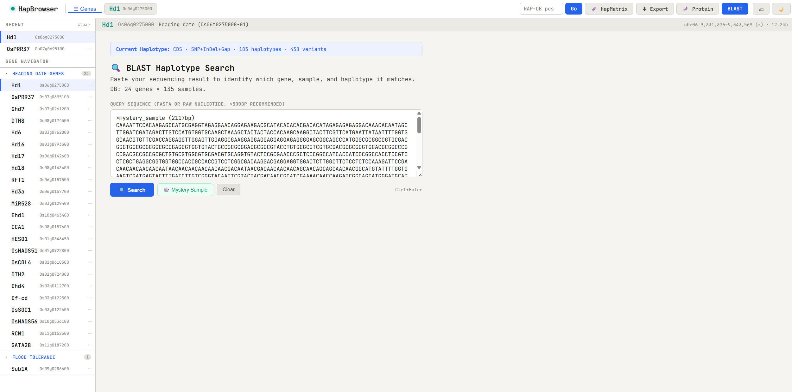

# Hap-Browser

> **Haplotype browser with integrated marker design**
>
> Visualize gene-level haplotype patterns across 200+ rice accessions, design KASP / InDel markers in-browser, and add new genes via a one-command Snakemake pipeline.

[](LICENSE)
[](CHANGELOG_pipeline.md)
[](https://react.dev/)
[](https://snakemake.github.io/)

<p align="center">
  
  <br>
  <em>Haplotype matrix view with 200 IRRI accessions across the Hd1 locus</em>
</p>

---

## Features

- **Per-gene haplotype matrix** — Sample × variant grid for any RAP-DB gene, with SNP / InDel / Gap clustering
- **Canvas-based rendering** — 60fps interaction with 200 samples × 10,000+ variant positions via virtual scrolling
- **KASP & InDel marker design** — Allele-specific primers with Primer3-validated Tm / hairpin / dimer
- **Variant-aware primer design** — Optionally avoid neighboring SNP/InDel sites in primer regions
- **Phenotype overlay** — Upload phenotype CSV → automatic haplotype-level box plots
- **Publication-ready export** — CSV matrices, Excel sheets, SVG box plots
- **Reproducible pipeline** — Snakemake workflow: FASTQ → BAM → pileup → haplotype → browser, in one command

## Quick Start

> **Prerequisite**: [Miniconda](https://docs.conda.io/en/latest/miniconda.html) installed. No sudo required.

```bash
# 0. Setup conda environment (Python + Node.js + BLAST+)
conda create -n hapbrowser -c conda-forge -c bioconda python=3.11 nodejs blast -y
conda activate hapbrowser

# 1. Clone the repository
git clone https://github.com/hyun52/hap-browser.git
cd hap-browser

# 2. Download pileup data (~773 MB) from the v1.0.0 release
wget https://github.com/hyun52/hap-browser/releases/download/v1.0.0/hap-browser-pileup-data-v1.0.0.tar.gz
tar xzf hap-browser-pileup-data-v1.0.0.tar.gz -C public/data/

# 3. Install JS dependencies
npm install

# 4. Install Python backend libraries
pip install -r backend/requirements.txt

# 5. Start frontend + backend
bash start.sh
# → Frontend: http://localhost:8080
# → Backend:  http://localhost:8081
```

The demo dataset includes 23 rice heading-date genes plus Sub1A across 200 IRRI accessions.

> Don't have conda? Install [Miniconda](https://docs.conda.io/en/latest/miniconda.html) first (one script, no sudo).

## Adding new genes (advanced)

The Quick Start above is enough to use the included demo data. To add **new genes** from your own FASTQ files, install the pipeline tools:

```bash
conda activate hapbrowser
conda install -c bioconda -c conda-forge snakemake bwa-mem2 samtools -y
```

Then follow [`USER_GUIDE_ADD_GENES.md`](USER_GUIDE_ADD_GENES.md).

| Pipeline tool | Version |
|---------------|---------|
| Snakemake | 9.x |
| BWA-MEM2  | 2.2.1+ |
| samtools  | 1.10+ | 

## Screenshots

### Visualization

<table>
<tr>
<td align="center" width="50%">
  <br>
  <sub><b>Genome view</b><br>JBrowse-style Canvas with zoom, pan, gene diagram</sub>
</td>
<td align="center" width="50%">
  <br>
  <sub><b>Protein view</b><br>Codon-level visualization with auto AA-change detection</sub>
</td>
</tr>
</table>

### Marker Design & Search

<table>
<tr>
<td align="center" width="50%">
  <br>
  <sub><b>KASP marker design</b><br>Allele-specific primers with Primer3 validation</sub>
</td>
<td align="center" width="50%">
  <br>
  <sub><b>BLAST search</b><br>Sequence search across haplotype consensus</sub>
</td>
</tr>
</table>

### Multi-position Analysis

<p align="center">
  <br>
  <sub><b>HapMatrix</b> — multi-gene position table with phenotype upload and box-plot analysis</sub>
</p>

## Architecture

```
┌─────────────────┐  Snakemake   ┌────────────────┐
│  FASTQ files    │ ───────────> │  per-gene BAM  │
│  (200 samples)  │  add_genes.sh│  pileup, JSON  │
└─────────────────┘              └────────┬───────┘
                                          │
                                          v
                  ┌────────────────────────────────────────┐
                  │ React + Canvas Frontend (Vite)         │
                  │ - GenomeView (Canvas + virtual scroll) │
                  │ - HapMatrix (custom position view)     │
                  │ - MarkerPanel (KASP / InDel design)    │
                  └─────────┬──────────────────────────────┘
                            │
                            v
                  ┌────────────────────────┐
                  │ FastAPI Backend        │
                  │ - /api/primer3/validate│
                  │ - /api/blast           │
                  └────────────────────────┘
```

### Tech stack

- **Pipeline**: [Snakemake](https://snakemake.github.io/) 9, [BWA-MEM2](https://github.com/bwa-mem2/bwa-mem2), [samtools](https://www.htslib.org/), [pysam](https://pysam.readthedocs.io/)
- **Frontend**: React 18, Vite 5, Canvas (no Konva/etc.), OffscreenCanvas + Web Workers for performance
- **Backend**: FastAPI, [primer3-py](https://libnano.github.io/primer3-py/), Uvicorn
- **Marker design**: Custom KASP algorithm + Primer3 validation (SantaLucia 1998 nearest-neighbor Tm, [Mg²⁺] / [dNTP] correction)

## Documentation

- [`USER_GUIDE_ADD_GENES.md`](USER_GUIDE_ADD_GENES.md) — Step-by-step gene addition
- [`README_pipeline.md`](README_pipeline.md) — Full pipeline reference
- [`CHANGELOG_pipeline.md`](CHANGELOG_pipeline.md) — Version history

## Demo Data

The included demo data covers:
- **23 rice heading-date genes** (Hd1, Ghd7, Ehd1, RFT1, OsMADS51, etc.)
- **1 flood-tolerance gene** (Sub1A)
- **200 IRRI accessions** from the 3K Rice Genomes Project

Note: BAM files are not included in the repository (~17 GB total). The browser still functions fully with the precomputed haplotype data. To regenerate BAMs, run the pipeline with your own copy of the FASTQ files.

## Contributing

This is an academic project under active development. Issues and pull requests are welcome:

- **Bug reports**: open an [issue](https://github.com/hyun52/hap-browser/issues) with the version and steps to reproduce
- **Feature requests**: open an issue describing the use case
- **Pull requests**: small, focused PRs preferred; please include a brief description

## License

This project is licensed under an **Academic Non-Commercial License**. See [`LICENSE`](LICENSE) for full terms.

- Free for academic and educational research
- Modification and redistribution allowed for academic use
- Commercial use prohibited without prior permission
- **Citation required** in publications

For commercial licensing inquiries, contact via GitHub.

## Citation

> **Note**: A peer-reviewed publication is in preparation. Until it is published, please cite this repository directly.

If you use HapBrowser in your research, please cite:

```bibtex
@software{hapbrowser2026,
  author    = {Lee, Hyunoh},
  title     = {HapBrowser: A Rice Haplotype Browser with Integrated Marker Design},
  year      = {2026},
  publisher = {Plant Genome and Breeding Lab, Jeonbuk National University},
  url       = {https://github.com/hyun52/hap-browser},
  version   = {1.0.0}
}
```

Once the manuscript is published, please cite the published article instead. This page will be updated with the journal reference and DOI.

Please also cite the underlying tools:
- **Snakemake**: Köster J. & Rahmann S. (2012). *Bioinformatics* 28(19):2520–2522.
- **BWA-MEM2**: Vasimuddin M. et al. (2019). *IPDPS* 314–324.
- **samtools / BCFtools**: Danecek P. et al. (2021). *GigaScience* 10(2).
- **Primer3**: Untergasser A. et al. (2012). *Nucleic Acids Res.* 40(15):e115.

## Acknowledgments

- **Reference data**: [RAP-DB](https://rapdb.dna.affrc.go.jp/) IRGSP-1.0
- **Sample data**: [IRRI 3K Rice Genomes Project](http://snp-seek.irri.org/)

---

<p align="center">
  <sub>Built with at PGBL Lab, JBNU</sub>
</p>
