# HapBrowser User Guide

> Step-by-step usage of every panel and feature.

## Table of Contents

1. [Quick Tour](#1-quick-tour) — main interface overview
2. [Selecting a Gene](#2-selecting-a-gene)
3. [Reading the Genome View](#3-reading-the-genome-view)
4. [Haplotype Classification](#4-haplotype-classification)
5. [KASP Marker Design](#5-kasp-marker-design)
6. [InDel Marker Design](#6-indel-marker-design)
7. [Multi-position Analysis (HapMatrix)](#7-multi-position-analysis-hapmatrix)
8. [BLAST Haplotype Search](#8-blast-haplotype-search)
9. [Sample Variety Names](#9-sample-variety-names)
10. [Protein View](#10-protein-view)
11. [Exporting Data](#11-exporting-data)
12. [Keyboard Shortcuts](#12-keyboard-shortcuts)

---

## 1. Quick Tour

When you first open HapBrowser (http://localhost:8080) and select a gene, the interface is divided into **five main areas**:

<p align="center">
  
</p>

### ① Top Bar

The top bar contains the current gene info and primary action buttons.

- **Gene name + RAP-DB ID** (e.g., `Hd1 · Os06g0275000`): currently loaded gene
- **`☰ Genes`**: open gene navigator
- **`RAP-DB pos`** input + **`Go`**: jump to a specific genomic coordinate within the gene
- **Action buttons** (right side):
  - **`HapMatrix`** — multi-position haplotype analysis with phenotype overlay
  - **`Export`** — download CSV (Excel)
  - **`Protein`** — toggle codon-level (AA) overlay in the Genome View
  - **`BLAST`** — search a sequence against the haplotype database

### ② Sidebar

Lists genes available in the browser.

- **Recent**: recently viewed genes (up to 4)
- **Gene Navigator**: groups (e.g., `Heading date genes`, `Flood tolerance`) → expandable lists of every registered gene
- Click any gene to load it. The currently selected gene is highlighted.

### ③ Annotation

The annotation rows above the haplotype matrix:

- **Transcription**: 5'→3' direction marker
- **RAP-DB position**: genomic coordinates (click `→ Local` to switch to gene-relative coords)
- **Reference**: reference base (A / T / G / C) at each position
- **Alt sample**: number of samples carrying the alternative allele
- **Alt read**: percentage of reads supporting the alt call (averaged across alt samples)

### ④ Genome View (Haplotype matrix)

The main visualization. Each row is one sample (or a group of identical haplotypes); each column is one variant position.

**Colors**:
- 🟦 **Blue** = `A`
- 🟩 **Green** = `T`
- 🟧 **Orange** = `G`
- 🟥 **Red** = `C`
- **`·`** = identical to reference
- **Gap (`-`)** = deletion

**Haplotype groups**: samples sharing identical patterns are grouped under colored headers (`Haplotype 1`, `Haplotype 2`, ...). The number indicates the haplotype rank (most common first).

**Interactions**:

| Action | Shortcut |
|--------|----------|
| Scroll vertically (samples) | Mouse wheel |
| Scroll horizontally (positions) | Horizontal wheel |
| Navigate | Arrow keys (↑ ↓ ← →) |
| Select a single SNP for **KASP** marker design | **Shift + Click** on a column |
| Select a range for **InDel** marker design | **Shift + Drag** across columns |
| View haplotype details | Click a haplotype header |

See [Section 5](#5-kasp-marker-design) for KASP and [Section 6](#6-indel-marker-design) for InDel design details.

### ⑤ Control Panel

Filters and classification options.

- **Range**: which region defines a "haplotype"
  - `Gene` — full gene region
  - `CDS` — coding sequence only
  - `Custom` — manually selected positions
- **Mode**: which variant types to use for haplotype clustering
  - `SNP`, `InDel`, `Gap` — toggleable
- **View**: visible region in the matrix
  - `All` — full extracted region (gene ± 5 kb flanking)
  - `Gene` — gene region only
  - `CDS` — coding sequence only
- **Show**: row visibility filters
  - `Identical` — show samples with no variants
  - `SNP`, `InDel`, `Gap` — show samples with each variant type
- **Sample Filter**: `Select All` / `Deselect All` / `Representatives` (one sample per haplotype)
- **Haplotype list**: clickable color-coded list of all haplotypes with sample counts. Click to filter the matrix to just that haplotype.

---

## 2. Selecting a Gene

There are three ways to load a gene in HapBrowser.

### A. From the sidebar (most common)

<p align="center">
  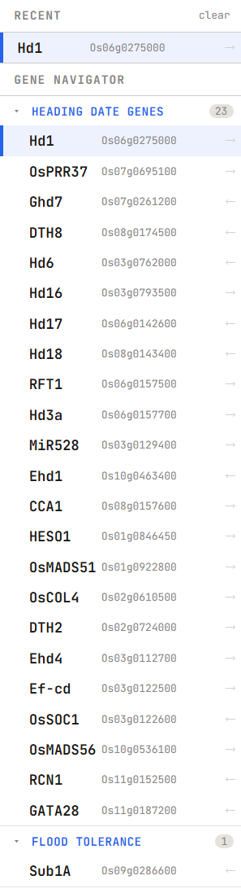
</p>

The **Gene Navigator** on the left lists all registered genes, grouped by trait category.

- **Recent**: up to 4 most recently viewed genes (current session). Click `clear` to reset.
- **Gene Navigator**: full gene list, organized by group (e.g., `Heading date genes`, `Flood tolerance`). The number badge shows how many genes are in each group.
  - Click a group header to expand or collapse it
  - Click any gene name (e.g., `Hd1`) to load it
- The currently active gene is **highlighted in blue**
- The small arrow on the right of each gene (`→` or `←`) indicates strand orientation (+ or − strand)

### B. Jump to a genomic coordinate

<p align="center">
  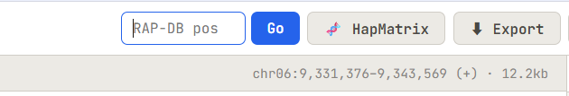
</p>

If you know the RAP-DB position of a SNP or feature you want to inspect:

1. Type the position into the **`RAP-DB pos`** input box at the top (e.g., `9336985`)
2. Click **`Go`** (or press Enter)
3. HapBrowser finds the gene containing this coordinate and loads it, scrolling the matrix to that position

This is useful when working from publications, GWAS results, or external databases that report specific genomic coordinates.

> **Note**: The coordinate must fall within one of the registered gene regions (gene body ± flanking). The current gene's range is shown to the right of the input (e.g., `chr06:9,331,376–9,343,569 (+) · 12.2kb`). If the position is outside any registered gene, an error message appears.

### C. Toggle the sidebar

Click the **`☰ Genes`** button in the top bar to collapse or expand the sidebar. Useful for getting more horizontal space when reading a wide haplotype matrix.

---

## 3. Reading the Genome View

The Genome View packs multiple layers of information above the haplotype matrix. This section explains how to read each one.

### Header and legends

<p align="center">
  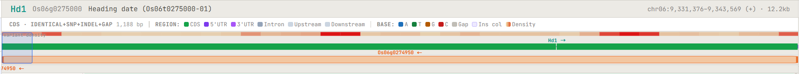
</p>

The top of the Genome View shows:

- **Gene info bar** (left): symbol, RAP-DB ID, group, and primary transcript ID — e.g., `Hd1 · Os06g0275000 · Heading date (Os06t0275000-01)`
- **Coordinate range** (right): `chr06:9,331,376–9,343,569 (+) · 12.2 kb` shows chromosome, genomic span, strand, and total length
- **Mode summary**: `CDS · IDENTICAL+SNP+INDEL+GAP · 1,188 bp` — current classification range, active variant types, and the number of bp in the displayed region
- **REGION legend**: color codes for `CDS`, `5'UTR`, `3'UTR`, `Intron`, `Upstream`, `Downstream`
- **BASE legend**: color codes for variant displays — `A` (blue), `T` (green), `G` (orange), `C` (red), `Gap`, `Ins col` (inserted column), `Density` (variant density bar)

### Variant density bar

The thin red/orange band at the top is a **variant density heatmap** across the entire region. 
Darker (red) = more variants in that window; lighter = fewer. Use this to quickly spot variant hotspots before zooming in.

### Gene track

Below the density bar, the gene track shows:

- **Boxes** = exons (CDS in dark green, UTRs in lighter colors)
- **Lines** = introns
- **Strand arrows** = direction (`→` for + strand, `←` for − strand)
- **Multiple tracks** = overlapping genes or antisense transcripts (e.g., `Os06g0274950 ←` runs antisense to Hd1)

### Annotation rows

Just above the haplotype matrix:

- **Transcription**: 5'→3' direction marker
- **RAP-DB position**: genomic coordinates of each visible column
  - Click **`→ Local`** to toggle between genomic and gene-relative (1-based from gene start) coordinates
- **Reference**: reference base (A / T / G / C) at each position, colored as in the BASE legend
- **Alt sample**: number of samples carrying any non-reference allele
- **Alt read**: average % of reads supporting the alt call across alt samples

> **Note**: Reading the haplotype matrix itself (cell colors, haplotype groups) is covered in [Section 1 Quick Tour ④](#-genome-view-haplotype-matrix). Controlling which region is visible is covered in [Section 4 Haplotype Classification](#4-haplotype-classification).

---

## 4. Haplotype Classification

The Control Panel on the right governs **how samples are grouped into haplotypes** and **what is shown** in the matrix.

<p align="center">
  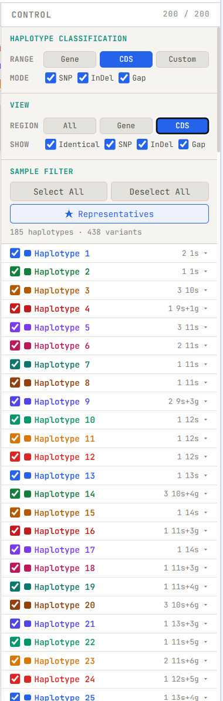
</p>

### Range — which region defines a haplotype

Determines the set of positions used to cluster samples.

| Option | Behavior |
|--------|----------|
| **Gene** | Use all variants within the gene body (UTRs + introns + CDS) |
| **CDS** | Use only variants within the coding sequence — fewer, biologically meaningful positions |
| **Custom** | Use only positions you specify manually (see below) |

### Mode — which variant types to use

Toggle which variant types contribute to haplotype clustering:

- **SNP** — single-base substitutions
- **InDel** — insertions and deletions
- **Gap** — gap regions (no mapping data)

Turning off `Gap`, for example, excludes samples differing only in coverage, leaving "true" haplotypes based on actual sequence differences.

### Custom Range — manually selected positions

<p align="center">
  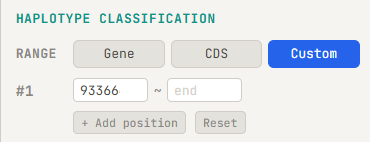
</p>

To classify by a specific position or region of interest:

1. Click **`Custom`** under RANGE
2. Type a **RAP-DB position** in the `#1` `start` box (e.g., `9336660`)
3. Optionally enter an `end` position for a range; leave it empty for a single position
4. Click **`+ Add position`** to add up to 10 more independent positions/ranges
5. Click **`Reset`** to clear all entries
6. The matrix and haplotype list update instantly

> **Tip**: Single-position mode is useful when classifying by one focal SNP (e.g., a GWAS lead variant). For example, entering position `9336660` of Hd1 yields 3 haplotypes based on that single SNP (Ref G, Alt C, and reference samples).

### View — what is visible in the matrix

Independent of Range. Controls **only display**, not classification.

| Option | Visible columns |
|--------|----------------|
| **All** | Full extracted region (gene ± 5 kb flanking) |
| **Gene** | Gene body only |
| **CDS** | Coding sequence only |

> **Tip**: `View` and `Range` can be set independently. For example, `Range = CDS` (classify by coding variants) + `View = All` (but show the full region for context).

### Show — row visibility filters

Toggle which sample rows appear in the matrix:

- **Identical** — samples with no variants in the current Range (reference-like)
- **SNP / InDel / Gap** — samples carrying each variant type

Useful for focusing on, e.g., only samples with InDels, or hiding all reference-identical samples.

### Sample Filter — Representatives

<p align="center">
  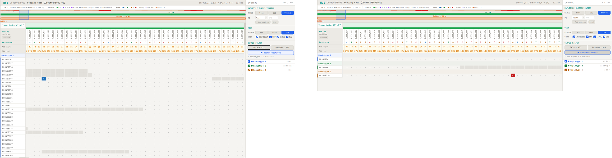
</p>

When working with many samples, **★ Representatives** shows just one sample per haplotype — the smallest non-redundant set.

- **Left**: full sample list (e.g., 200 samples, all rows shown)
- **Right**: after clicking `Representatives` — only one sample per haplotype remains, plus the haplotype list collapses to show only headers with sample counts

Useful for:
- Publication figures (cleaner matrix)
- Downstream sequence analysis (one representative per haplotype = unique sequences)

Use **`Select All`** / **`Deselect All`** to toggle every sample at once. Click individual sample rows to manually include/exclude them.

### Haplotype list

Color-coded list of all current haplotypes with their sample counts (shown as `n s` next to the name).

- The color circle matches the haplotype's color in the matrix
- Click a haplotype to filter the matrix to only those samples
- The summary line above (e.g., `185 haplotypes · 438 variants`) reflects current Range + Mode settings

---

## 5. KASP Marker Design

KASP (Kompetitive Allele Specific PCR) is a fluorescence-based SNP genotyping assay
widely used for marker-assisted selection in plant breeding. HapBrowser includes a
built-in KASP marker designer that takes any SNP from the genome view and produces
ready-to-order primer sets, complete with Primer3-based thermodynamic validation
and expected FAM/HEX sample clustering.

This section walks through the full KASP design workflow using a SNP in *Hd1*
(`Os06g0275000`) at position `9,338,330` as a running example.

---

### 5.1 Selecting a target SNP

To start a KASP design, **Shift+Click** the column header of the SNP you want to
target in the genome view. The column highlights and a toast notification at the
bottom shows the selected coordinate range. Releasing the Shift key opens the
Marker Design modal.

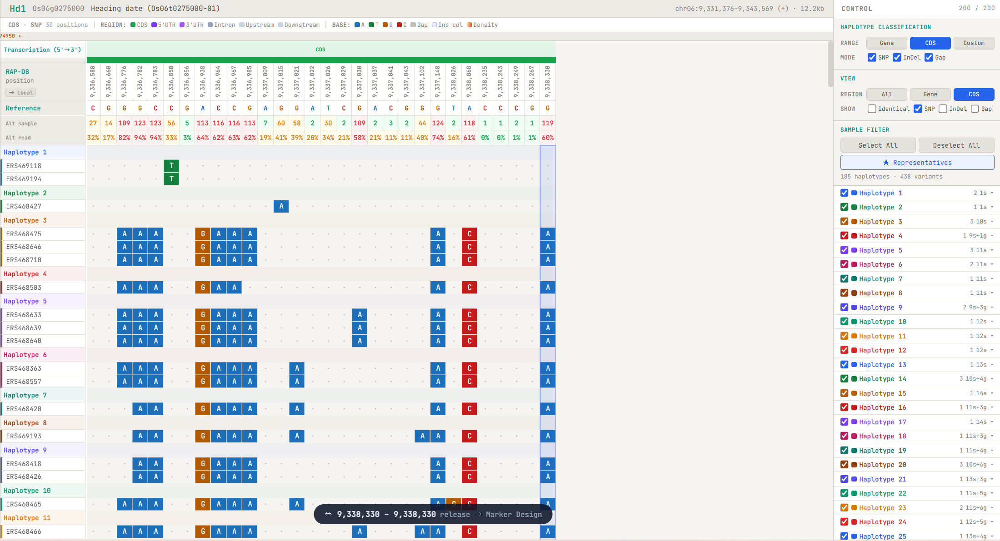

In the example above, the target SNP is `9,338,330 G→A` (RAP-DB coordinate) in the
*Hd1* CDS. The toast at the bottom confirms the selection:

```
⇔ 9,338,330 - 9,338,330  release → Marker Design
```

> **Tip:** You can also Shift+Click multiple columns to select a range. For KASP
> designs, only single-position selections are used — the SNP at the 3' end of the
> ASP defines the allele-specific discrimination. Multi-position ranges are
> intended for InDel marker design (see Section 6) or HapMatrix analysis
> (see Section 7).

---

### 5.2 Marker Design modal overview

Once the modal opens, you see two tabs at the top — **KASP (SNP)** and
**InDel Marker** — and the selected coordinate range in the top-right badge.
The modal starts in a collapsed state showing only the SNP position. Clicking
the SNP Position badge activates it, revealing FAM/HEX allele assignments and
the per-haplotype distribution.

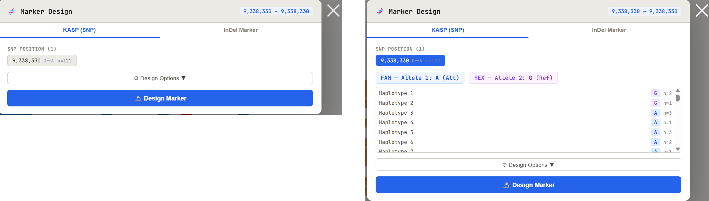

**Modal anatomy:**

- **Tabs (top)** — Switch between `KASP (SNP)` and `InDel Marker` design modes.
- **Range badge (top-right)** — The selected genomic range, e.g. `9,338,330 - 9,338,330`.
- **SNP POSITION** — Lists all SNPs in the selected range. Click a position to
  activate it (badge turns blue).
- **FAM / HEX allele badges** — After activation, alleles are auto-assigned to
  the two KASP fluorescence channels.
- **Haplotype list** — Each haplotype's allele (`G`/`A` badge) and sample count
  (`n=`).
- **Design Options** (collapsible) — Tunable parameters for primer design
  (covered in Section 5.3).
- **Design Marker** (blue button) — Runs the design with current settings.

**FAM/HEX assignment convention:**

By default, HapBrowser assigns the **alternative allele to FAM** and the
**reference allele to HEX**:

- `FAM — Allele 1: A (Alt)` — the Alt allele (A) goes to the FAM channel.
- `HEX — Allele 2: G (Ref)` — the Ref allele (G) goes to the HEX channel.

This convention follows common breeding practice where the trait-associated or
rarer allele is reported on the FAM channel for easier downstream cluster
interpretation. You can manually swap the assignment in the exported primer
sequences if your KASP plate layout requires a different convention.

**Reading the haplotype distribution:**

Each row in the haplotype list shows which allele is carried by that haplotype,
along with the sample count. For example:

| Haplotype | Allele | n |
|-----------|--------|---|
| Haplotype 1 | G | 2 |
| Haplotype 2 | G | 1 |
| Haplotype 3 | A | 3 |
| Haplotype 4 | A | 1 |
| Haplotype 5 | A | 3 |
| ... | ... | ... |

This lets you preview the expected sample clustering before running the design.

---

### 5.3 Design Options

Click **Design Options ▼** to expand the parameter panel. All KASP design
parameters are tunable, but the defaults are calibrated for standard rice KASP
assays under typical reaction conditions.

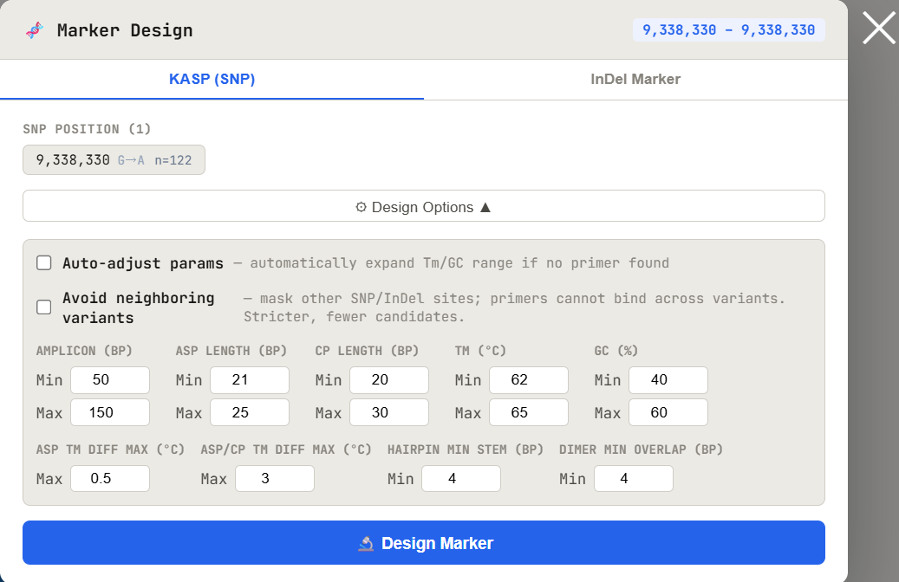

**Top-level toggles:**

- **Auto-adjust params** — If no primer satisfies the current Tm/GC constraints,
  the designer automatically expands the search window. Useful for difficult
  regions; turn off for strict reproducibility.
- **Avoid neighboring variants** — Masks all other SNP/InDel sites in the primer
  binding region; primers cannot span any variant. Stricter (fewer candidates,
  higher specificity). This option is critical when designing markers for
  diverse panels — see Section 5.5 for troubleshooting.

**Length and composition:**

| Parameter | Default | Description |
|-----------|---------|-------------|
| Amplicon (bp) | 50–150 | Total PCR product length |
| ASP length (bp) | 21–25 | Allele-specific primer length |
| CP length (bp) | 20–30 | Common primer length |
| Tm (°C) | 62–65 | Melting temperature window |
| GC (%) | 40–60 | GC content window |

**Differential and structural constraints:**

| Parameter | Default | Description |
|-----------|---------|-------------|
| ASP Tm diff max (°C) | 0.5 | Maximum Tm difference between the two ASPs (FAM vs HEX) |
| ASP/CP Tm diff max (°C) | 3 | Maximum Tm difference between ASPs and Common Primer |
| Hairpin min stem (bp) | 4 | Minimum stem length to flag as a hairpin |
| Dimer min overlap (bp) | 4 | Minimum overlap to flag as a dimer |

> **Note:** The Tm targets here refer to the **built-in nearest-neighbor
> calculation** used during candidate generation. Primer3 validation
> (see Section 5.4) re-computes Tm under explicit reaction conditions
> (50 mM Na⁺, 1.5 mM Mg²⁺, 0.2 mM dNTP, 250 nM oligo) and may report values
> ~0.3°C higher. This difference is expected and harmless.

---

### 5.4 Successful design result

Click **Design Marker** to run the design. A successful result expands into
three sections: the primer table, the Primer3 validation panel, and the
expected sample groups. An **Export** button (top-right) downloads a
plain-text summary suitable for ordering and record-keeping.

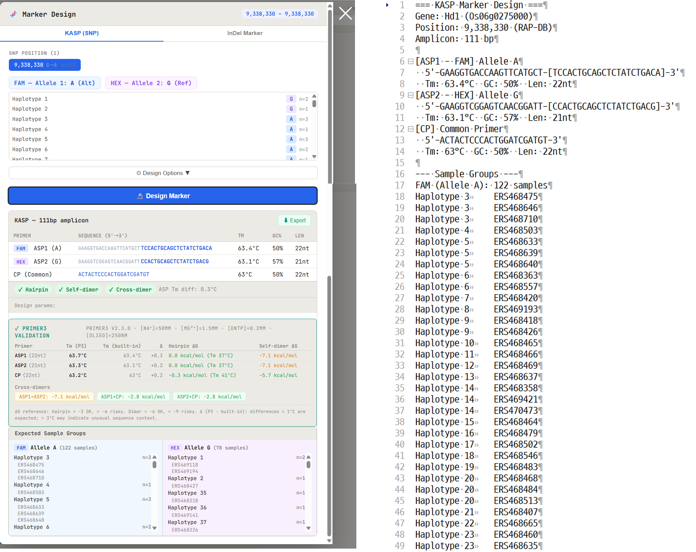

#### Primer table

The primer table shows the three primers required for a KASP assay:

| Primer | Sequence (5'→3') | Tm | GC% | Length |
|--------|------------------|----|----|--------|
| `FAM ASP1 (A)` | `GAAGGTGACCAAGTTCATGCT-TCCACTGCAGCTCTATCTGACA` | 63.4 °C | 50% | 22 nt |
| `HEX ASP2 (G)` | `GAAGGTCGGAGTCAACGGATT-CCACTGCAGCTCTATCTGACG` | 63.1 °C | 57% | 21 nt |
| `CP (Common)` | `ACTACTCCCACTGGATCGATGT` | 63 °C | 50% | 22 nt |

The **gray prefix** on each ASP is the universal tail required for KASP
chemistry — `GAAGGTGACCAAGTTCATGCT` for FAM and `GAAGGTCGGAGTCAACGGATT` for HEX.
The **blue, bolded segment** is the allele-specific portion. The 3' terminal
base discriminates the SNP (A vs G in this example).

The chip row below the table summarizes structural QC:

- ✓ **Hairpin** — No internal secondary structure above threshold.
- ✓ **Self-dimer** — No problematic self-pairing.
- ✓ **Cross-dimer** — No primer-pair interaction above threshold.
- `ASP Tm diff: 0.3°C` — The two ASPs are well-matched in Tm.

#### Primer3 validation

The Primer3 validation panel re-computes thermodynamics using **Primer3
v2.3.0** under explicit KASP-like buffer conditions (50 mM Na⁺, 1.5 mM Mg²⁺,
0.2 mM dNTP, 250 nM oligo). This serves as an independent cross-check on the
built-in calculation.

| Primer | Tm (P3) | Tm (built-in) | Δ | Hairpin ΔG | Self-dimer ΔG |
|--------|---------|---------------|---|------------|---------------|
| ASP1 (22 nt) | 63.7 °C | 63.4 °C | +0.3 | 0.0 kcal/mol (Tm 37 °C) | −7.1 kcal/mol |
| ASP2 (21 nt) | 63.3 °C | 63.1 °C | +0.2 | 0.0 kcal/mol (Tm 37 °C) | −7.1 kcal/mol |
| CP (22 nt) | 63.2 °C | 63 °C | +0.2 | −0.3 kcal/mol (Tm 41 °C) | −5.7 kcal/mol |

**Cross-dimer ΔG:**

- `ASP1×ASP2: -7.1 kcal/mol` (orange — borderline)
- `ASP1×CP: -2.8 kcal/mol` (green — safe)
- `ASP2×CP: -2.8 kcal/mol` (green — safe)

**Color coding:**

| Color | Hairpin ΔG | Dimer ΔG | Interpretation |
|-------|------------|----------|----------------|
| 🟢 green | > −3 | > −6 | Safe |
| 🟠 orange | −3 to −6 | −6 to −9 | Caution — usually still works |
| 🔴 red | < −6 | < −9 | Risky — consider redesign |

> **Note:** ASP1×ASP2 cross-dimer is often slightly elevated in KASP designs
> because both ASPs share the same 3'-region (they differ only at the SNP base).
> A ΔG of −7 kcal/mol is within normal KASP operating range; values below
> −9 kcal/mol warrant redesign.

#### Expected Sample Groups

The bottom panel previews which samples should fall into the FAM and HEX
clusters based on the haplotype-allele assignments:

- **FAM Allele A** — 122 samples across Haplotypes 3, 4, 5, 6, ...
- **HEX Allele G** — 78 samples across Haplotypes 1, 2, 35, 36, 37, ...

Each group lists individual sample IDs (e.g., `ERS468475`, `ERS469118`) so you
can pre-select reference controls for the KASP plate.

#### Exported text file

Clicking **Export** downloads a plain-text file with all primer information,
formatted for easy copy-paste into ordering forms:

```
=== KASP Marker Design ===
Gene: Hd1 (Os06g0275000)
Position: 9,338,330 (RAP-DB)
Amplicon: 111 bp

[ASP1 — FAM] Allele A
  5'-GAAGGTGACCAAGTTCATGCT-[TCCACTGCAGCTCTATCTGACA]-3'
  Tm: 63.4°C  GC: 50%  Len: 22nt
[ASP2 — HEX] Allele G
  5'-GAAGGTCGGAGTCAACGGATT-[CCACTGCAGCTCTATCTGACG]-3'
  Tm: 63.1°C  GC: 57%  Len: 21nt
[CP] Common Primer
  5'-ACTACTCCCACTGGATCGATGT-3'
  Tm: 63°C  GC: 50%  Len: 22nt

--- Sample Groups ---
FAM (Allele A): 122 samples
  Haplotype 3      ERS468475
  Haplotype 3      ERS468646
  Haplotype 3      ERS468710
  ...
```

The square brackets `[...]` around the allele-specific portion of each ASP make
it easy to inspect or modify the discrimination region without re-typing the
universal tail. You can paste these sequences directly into KASP ordering forms
(LGC Biosearch, Standard BioTools, etc.) — most vendors accept the bracketed
notation or simply strip it.

---

### 5.5 Troubleshooting: blocking variants

When **Avoid neighboring variants** is turned on, the designer masks every
SNP/InDel position within the candidate primer-binding region. If no candidate
can avoid all nearby variants, the design fails with a detailed error message
explaining what blocked it.

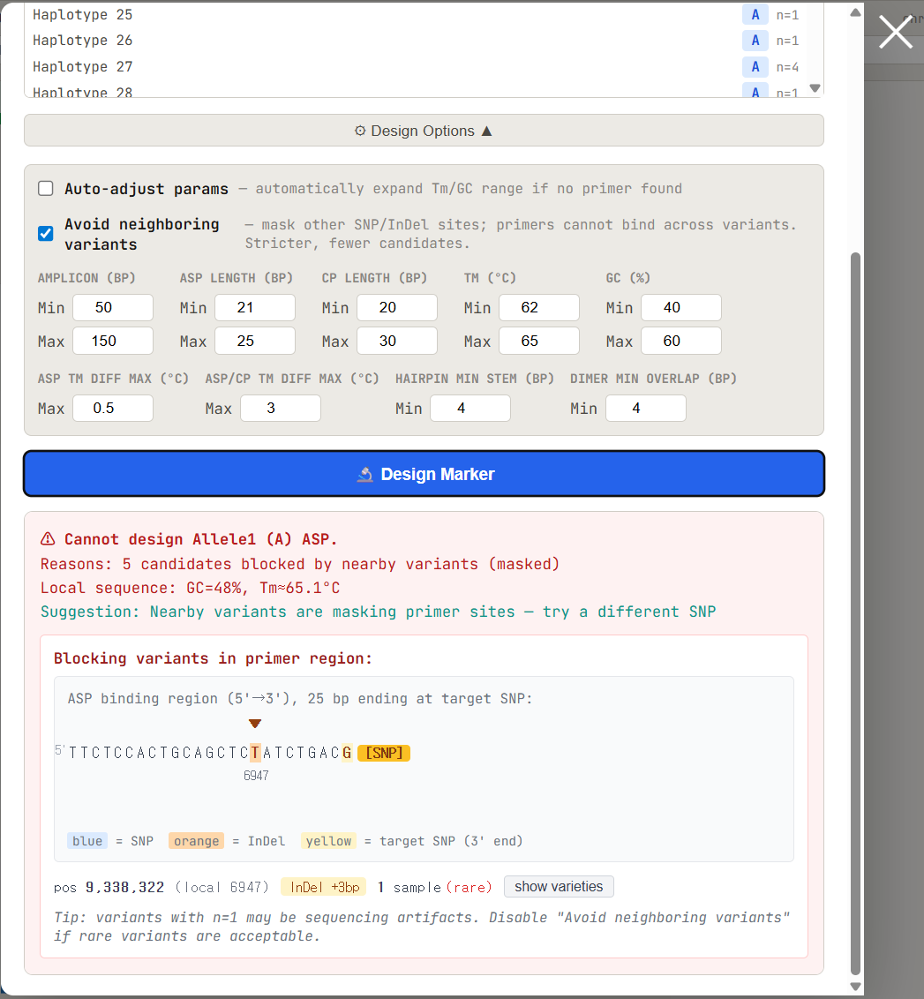

**Error anatomy:**

```
⚠ Cannot design Allele1 (A) ASP.
Reasons: 5 candidates blocked by nearby variants (masked)
Local sequence: GC=48%, Tm≈65.1°C
Suggestion: Nearby variants are masking primer sites — try a different SNP
```

Below the error, HapBrowser visualizes the primer-binding region with the
target SNP at the 3' end and color-coded annotations for blocking variants:

```
ASP binding region (5'→3'), 25 bp ending at target SNP:
                  ▼
  5' TTCTCCACTGCAGCTCT[T]ATCTGACG [SNP]
                       6947
  blue = SNP   orange = InDel   yellow = target SNP (3' end)
```

The blocking variant is then listed explicitly:

```
pos 9,338,322  (local 6947)  InDel +3bp  1 sample (rare)  [show varieties]
```

This tells you:

- **Where** the variant is (RAP-DB position and local coordinate within the gene)
- **What kind** (SNP or InDel, and the indel size if applicable)
- **How common** (sample count and a "rare" tag when n=1)
- **Who** carries it (click **show varieties** to expand the sample list)

**Decision guide:**

The tip line at the bottom of the error gives the key heuristic:

> *Tip: variants with n=1 may be sequencing artifacts. Disable "Avoid
> neighboring variants" if rare variants are acceptable.*

| Blocking variant profile | Recommended action |
|--------------------------|---------------------|
| `n=1` and labeled `rare` | Likely a sequencing artifact or singleton; disabling **Avoid neighboring variants** is usually safe |
| Low frequency (n=2–5) in panel outliers | Inspect via **show varieties**; if the carriers are not in your target germplasm, disable the option |
| Common variant (n>10) | Do not disable — primer will fail in a meaningful fraction of samples. Try a different target SNP, or shorten ASP length |
| Multiple blocking variants at different positions | Consider shifting to a nearby SNP, or use a longer amplicon to allow the designer more flexibility |

**Alternative strategies if redesign keeps failing:**

1. **Enable Auto-adjust params** — Lets the designer expand Tm/GC windows.
2. **Shorten the ASP length range** — e.g., 18–22 bp instead of 21–25 bp.
3. **Switch target SNP** — Re-open the genome view and select a different
   discriminating position in the same haplotype block.
4. **Switch to InDel Marker design** — If the haplotype is distinguished by a
   structural variant rather than a SNP, an InDel marker may be more robust
   (see Section 6).

> **Warning:** Disabling **Avoid neighboring variants** can produce primers
> that bind across rare variants. For most KASP applications this is
> acceptable, but if you plan to genotype a diverse panel that includes the
> rare variant carrier, expect occasional failed reactions for those samples.
> Always cross-check the **show varieties** list against your target
> germplasm before proceeding.

---

## 6. InDel Marker Design

InDel (Insertion/Deletion) markers are a low-cost alternative to KASP for
distinguishing haplotypes that differ by insertion or deletion polymorphisms.
Genotyping requires only standard PCR plus gel electrophoresis — no
fluorescence reader or universal-tail primers needed. HapBrowser's InDel
marker designer takes any genomic range, identifies all InDel/Gap variants
within it, and produces Forward/Reverse primers along with the expected
band pattern for each haplotype.

This section walks through the InDel design workflow using a 37 bp range in
*Hd1* (`9,337,032 - 9,337,068`) that contains multiple InDel polymorphisms.

---

### 6.1 Selecting a target range

Unlike KASP (which targets a single SNP), InDel marker design uses a
**range**. Hold **Shift** and **drag** across the column headers in the
genome view to select multiple consecutive positions. The selected columns
are highlighted in light blue, and the toast at the bottom shows the range
and its length.

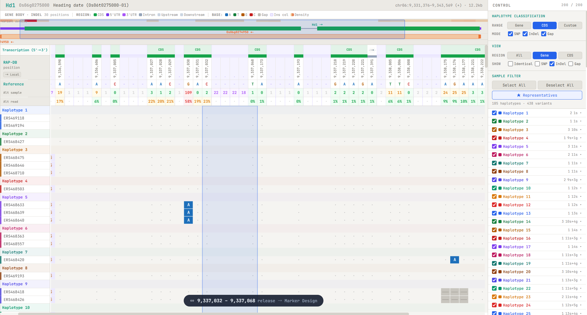

In the example above, the selected range is `9,337,032 - 9,337,068` (37 bp)
in the *Hd1* CDS. The toast confirms:

```
⇔ 9,337,032 - 9,337,068  release → Marker Design
```

> **Tip:** To focus on regions with InDels, toggle the **MODE** filter in
> the Control panel — enabling only `InDel` and `Gap` (and disabling `SNP`)
> hides SNP columns and makes InDel-rich regions easier to spot. The
> sidebar in the example shows all three modes enabled to provide full
> context.

> **Note:** A range as short as 1 bp is technically allowed (the designer
> will fall back to flanking the position), but a range of at least
> ~20–50 bp containing one or more InDels is the typical use case. Wider
> ranges give the designer more flexibility to place primers in
> variant-free flanking regions.

---

### 6.2 Marker Design modal overview

When the modal opens, the **InDel Marker** tab is selected automatically
(based on the range width). The top section summarizes the variant
composition within the selected range, and the **Expected Band Pattern**
panel previews how samples will cluster on a gel.

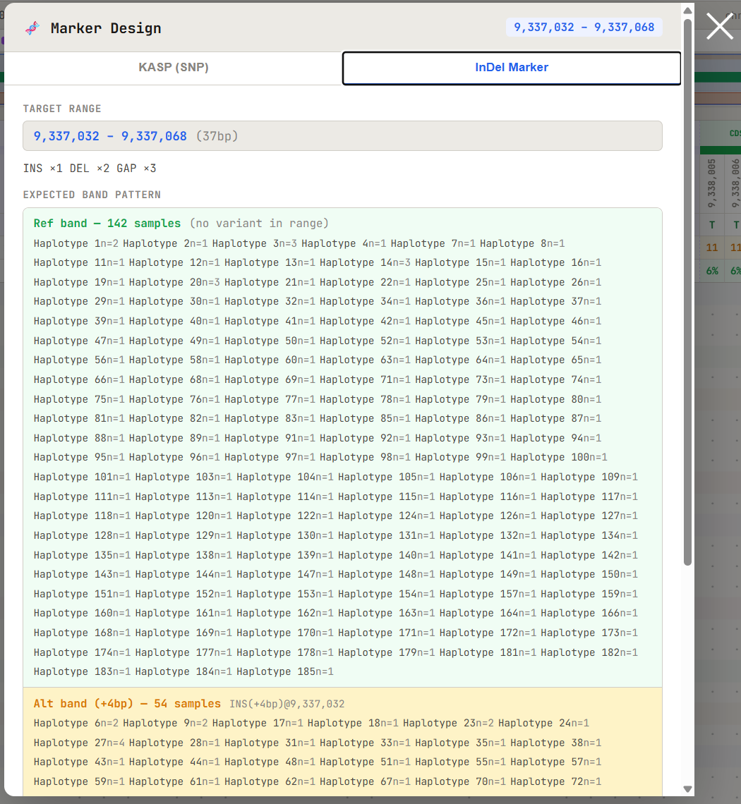

**Modal anatomy:**

- **Tabs (top)** — `KASP (SNP)` / `InDel Marker`. The InDel tab is active here.
- **Range badge (top-right)** — Selected genomic range, e.g. `9,337,032 - 9,337,068`.
- **TARGET RANGE** — Range coordinates and length (`37bp`).
- **Variant counts** — `INS ×1 DEL ×2 GAP ×3` summarizes how many variants
  of each type fall within the range.
- **EXPECTED BAND PATTERN** — Lists the distinct bands you should see on
  a gel, grouped by net amplicon size offset relative to the reference.

**Reading the Expected Band Pattern:**

Each band group is one row of haplotypes that will produce the same
amplicon size. In this example, four distinct bands are predicted:

| Band | Size offset | Samples | Composition |
|------|-------------|---------|-------------|
| 🟢 Ref band | 0 (reference) | 142 | No variant in range |
| 🟠 Alt band | +4 bp | 54 | `INS(+4bp)@9,337,032` |
| 🟠 Alt band | +3 bp | 3 | `INS(+4bp)@9,337,032, DEL(-1bp)@9,337,068` |
| 🟠 Alt band | −3 bp | 1 | `GAP(-1bp)@9,337,053, GAP(-1bp)@9,337,054, GAP(-1bp)@9,337,055` |

This preview is computed before primer design begins, so you can decide
whether the band-size differences will actually be resolvable on your gel
of choice (see Section 6.5).

> **Note:** "Net offset" is the sum of all InDel sizes within the range.
> A `+4bp` insertion and a `-1bp` deletion in the same haplotype yield a
> `+3bp` net offset and therefore co-migrate as a single band on a gel.
> The sample composition column shows which exact variants make up each
> band — useful for predicting which germplasm subset falls into each
> cluster.

---

### 6.3 Design Options

Scroll down past the Expected Band Pattern to find the **Design Options**
panel. Most parameters are shared with the KASP designer, but the option
set is simpler because InDel primers do not need FAM/HEX universal tails
or allele-specific 3' ends.

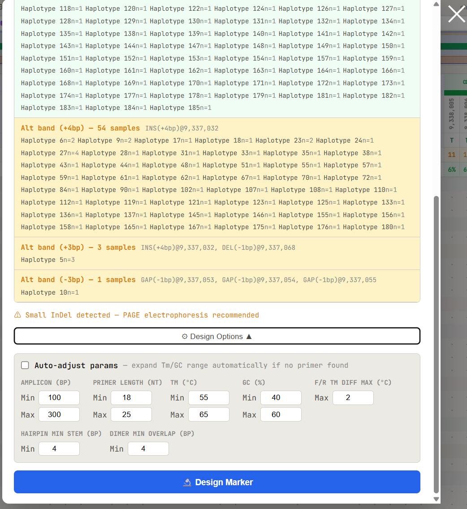

Before the options panel, note the additional band-pattern entries and a
warning callout:

```
⚠ Small InDel detected — PAGE electrophoresis recommended
```

This appears whenever any predicted band differs from another by less than
~10 bp. Polyacrylamide gel electrophoresis (PAGE) resolves small size
differences far better than standard agarose; see Section 6.5 for gel
selection guidance.

**Tunable parameters:**

| Parameter | Default | Description |
|-----------|---------|-------------|
| Amplicon (bp) | 100–300 | Total PCR product length |
| Primer length (nt) | 18–25 | Forward and Reverse primer length |
| Tm (°C) | 55–65 | Melting temperature window |
| GC (%) | 40–60 | GC content window |
| F/R Tm diff max (°C) | 2 | Maximum Tm difference between Forward and Reverse |
| Hairpin min stem (bp) | 4 | Minimum stem length to flag as a hairpin |
| Dimer min overlap (bp) | 4 | Minimum overlap to flag as a dimer |

**Auto-adjust params** — Same as in the KASP designer; expands Tm/GC
windows automatically if no candidate is found under the current
constraints.

> **Tip:** For small InDels (≤5 bp), reduce **Amplicon max** to ~150 bp.
> Shorter amplicons make a few-bp size difference proportionally larger,
> which is much easier to score on a gel. For large InDels (>20 bp), the
> default 100–300 bp range works on standard 2% agarose.

> **Note:** Unlike KASP, the InDel designer has no **Avoid neighboring
> variants** option — variants *inside* the amplicon are expected (they're
> the whole point of the assay). Primers are still placed in variant-free
> flanking regions wherever possible.

---

### 6.4 Successful design result

Click **Design Marker** to run the design. The result panel shows the
primer pair, Primer3 thermodynamic validation, and an Export button. The
exported text file includes the full band pattern with per-haplotype
sample IDs.

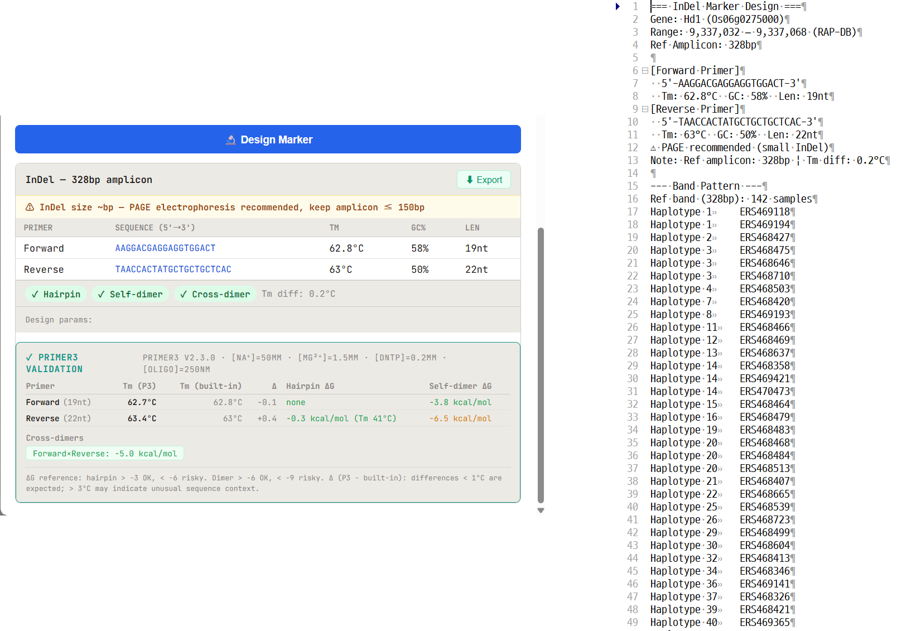

#### Primer table

InDel primers are standard Forward/Reverse PCR primers — no universal
tails, no allele-specific 3' ends:

| Primer | Sequence (5'→3') | Tm | GC% | Length |
|--------|------------------|----|----|--------|
| `Forward` | `AAGGACGAGGAGGTGGACT` | 62.8 °C | 58% | 19 nt |
| `Reverse` | `TAACCACTATGCTGCTGCTCAC` | 63 °C | 50% | 22 nt |

A header line shows the amplicon length (`InDel — 328bp amplicon`) and,
when applicable, the small-InDel warning:

```
⚠ InDel size ~bp — PAGE electrophoresis recommended, keep amplicon ≤ 150bp
```

In this example the designer used a 328 bp amplicon because the default
Amplicon max was 300 (auto-adjusted slightly upward to find a valid
primer pair). For routine small-InDel scoring you would tighten the
amplicon max first (see Section 6.3 tip).

QC chips below the table summarize structural validation:

- ✓ **Hairpin** / ✓ **Self-dimer** / ✓ **Cross-dimer**
- `Tm diff: 0.2°C` — Forward and Reverse are well-matched

#### Primer3 validation

The same Primer3 v2.3.0 cross-check as in KASP, under standard PCR buffer
conditions:

| Primer | Tm (P3) | Tm (built-in) | Δ | Hairpin ΔG | Self-dimer ΔG |
|--------|---------|---------------|---|------------|---------------|
| Forward (19 nt) | 62.7 °C | 62.8 °C | −0.1 | none | −3.8 kcal/mol |
| Reverse (22 nt) | 63.4 °C | 63 °C | +0.4 | −0.3 kcal/mol (Tm 41 °C) | −6.5 kcal/mol |

**Cross-dimer ΔG:** `Forward×Reverse: −5.0 kcal/mol` (green — safe).

The color-coding thresholds match those used for KASP (see Section 5.4).

#### Exported text file

Clicking **Export** downloads a plain-text summary that combines primer
info with the full Band Pattern listing:

```
=== InDel Marker Design ===
Gene: Hd1 (Os06g0275000)
Range: 9,337,032 - 9,337,068 (RAP-DB)
Ref Amplicon: 328bp

[Forward Primer]
  5'-AAGGACGAGGAGGTGGACT-3'
  Tm: 62.8°C  GC: 58%  Len: 19nt
[Reverse Primer]
  5'-TAACCACTATGCTGCTGCTCAC-3'
  Tm: 63°C  GC: 50%  Len: 22nt
△ PAGE recommended (small InDel)
Note: Ref amplicon: 328bp | Tm diff: 0.2°C

--- Band Pattern ---
Ref band (328bp): 142 samples
  Haplotype 1      ERS469118
  Haplotype 1      ERS469194
  Haplotype 2      ERS468427
  ...
```

The Band Pattern section lists every sample under its predicted band size,
which is the exact format you'll want when scoring a gel image — read off
the band size for each lane, then look up the haplotype assignment in this
file.

> **Tip:** Save the exported file alongside your gel images for traceable
> genotyping records. The combination of (PCR conditions, expected band
> sizes, expected sample-to-haplotype mapping) is enough to reconstruct
> the assay months later.

---

### 6.5 InDel size and gel resolution

The single most important InDel marker design decision is **whether your
gel can resolve the predicted band sizes**. Use this guide:

| InDel size | Recommended amplicon | Recommended gel | Resolution |
|------------|---------------------|-----------------|------------|
| 1–5 bp | ≤ 150 bp | PAGE (6–10%) or capillary | Required for reliable scoring |
| 5–20 bp | 100–300 bp | 3–4% agarose (high-resolution) | Generally OK; PAGE for ambiguous cases |
| 20–50 bp | 200–500 bp | 2–3% agarose | Easy on standard gels |
| > 50 bp | 300 bp – 1 kb | 1.5–2% agarose | Trivial; standard conditions |

**Why amplicon size matters:**

A 4 bp size difference is ~1.2% of a 328 bp amplicon but ~3.6% of a
~110 bp amplicon. Smaller amplicons make the same absolute size
difference proportionally larger on a gel, which translates directly to
band separation. The Small-InDel warning in HapBrowser uses this
principle — if you accept its tip to tighten the amplicon max, the gel
result becomes far more interpretable.

**Multiple Alt bands:**

In the running example, three distinct Alt bands are predicted (+4 bp,
+3 bp, −3 bp). This means a single PCR can resolve up to four haplotype
groups in one lane — provided the gel can separate them. If your panel
of interest only carries the +4 bp variant (the major Alt allele with
54 samples), the assay simplifies to a 2-band score (Ref vs +4 bp).
Always cross-check the sample composition of each predicted band against
your target germplasm before assuming all bands will be scoreable.

> **Tip:** When designing for a diverse panel with multiple Alt bands,
> include a heterozygous control (a sample known to carry both Ref and
> the major Alt allele) on every gel. Heterozygotes display both bands
> and serve as a positional reference for scoring homozygous lanes.

> **Warning:** If two predicted bands differ by ≤ 2 bp, even PAGE may
> struggle to resolve them reliably. In that case, consider switching to
> a KASP marker designed on a SNP that linkage-segregates with the InDel,
> or use capillary fragment analysis (e.g., Applied Biosystems 3500) for
> single-base resolution.

---

## 7. Multi-position Analysis (HapMatrix)

HapMatrix is a cross-gene haplotype analysis view that lets you combine
positions from **multiple different genes** into a single composite haplotype
table — something the standard per-gene Genome View cannot do. Optionally,
you can upload a phenotype TSV and HapMatrix will automatically generate
per-haplotype summary statistics and box plots for every numeric trait.

Typical use cases:

- Combining lead SNPs from a GWAS across several genes (e.g.,
  *Hd1* + *Ghd7* + *Hd18*) and asking how the **combinatorial haplotype**
  associates with a trait.
- Building a one-figure summary that connects multi-locus genotype to
  phenotype — suitable for publication or grant figures.
- Quickly checking how many samples carry each cross-gene allele combination
  before designing a downstream assay.

This section walks through the full workflow using the example data
(Hd1 + Ghd7 + Hd18, 200 IRRI accessions, three traits).

---

### 7.1 Opening HapMatrix

HapMatrix is reached from the **`HapMatrix`** button in the Top Bar (see
Section 1 ①).


Click **`HapMatrix`** to switch the main view to the HapMatrix interface.
The current gene's settings remain loaded in the background — clicking the
**back arrow** (`←`) in the top-left of HapMatrix returns you to the
Genome View exactly where you left off.

> **Note:** HapMatrix is not a separate page — it is a view within the same
> single-page application. Your gene selection, Control Panel state, and
> any HapMatrix entries you have built up are all preserved as you navigate
> back and forth. Only **Full Reset** (Section 7.5) clears HapMatrix state.

---

### 7.2 HapMatrix interface overview

When you first open HapMatrix with no prior entries, the interface shows
two stacked sections: **GENE POSITIONS** (required) at the top and
**PHENOTYPE DATA** (optional) below.

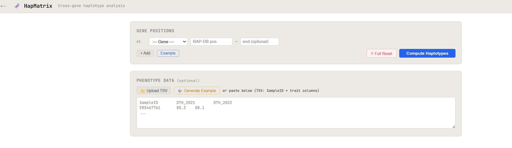

**Interface elements:**

- **Header** — `HapMatrix · Cross-gene haplotype analysis` with a `←` back
  arrow to return to the Genome View.
- **GENE POSITIONS** — Build one row per position you want to include in
  the composite haplotype. Each row has:
  * **Gene dropdown** — Pick from any registered gene (same list as the
    Genome View sidebar).
  * **RAP-DB pos** input — The genomic coordinate within that gene.
  * **end (optional)** — For range-based haplotyping; leave empty for a
    single position.
  * **`×`** button — Remove this row.
- **`+ Add`** — Append another position row (no fixed maximum).
- **`Example`** — Fill in three demo positions (Hd1 + Ghd7 + Hd18) plus a
  three-trait phenotype TSV — useful for a first run.
- **`Full Reset`** — Clear all positions and phenotype data (with
  confirmation).
- **`Compute Haplotypes`** — Run the analysis with current inputs.
- **PHENOTYPE DATA (optional)** — TSV input area with three sub-options:
  * **`Upload TSV`** — Choose a `.tsv` file from disk.
  * **`Generate Example`** — Fill in a demo TSV with 200 samples × 3 traits.
  * **`Clear`** — Empty the TSV area.
  * **Paste box** — Paste TSV text directly.

> **Tip:** The fastest way to explore HapMatrix on first use is to click
> **`Example`** in the Gene Positions section followed by
> **`Compute Haplotypes`**. This loads three real GWAS-relevant positions
> and a synthetic phenotype TSV, so you can see the full pipeline output
> in one click.

---

### 7.3 Defining gene positions and computing haplotypes

Click **`Example`** (or build your own list with `+ Add`) to populate the
Gene Positions section, then click **`Compute Haplotypes`** to generate
the composite haplotype table.

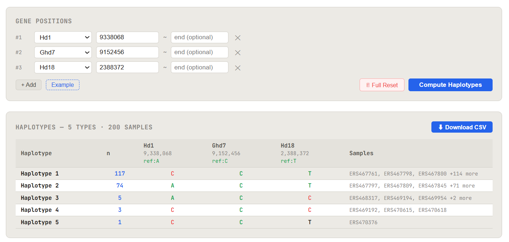

In the example above, three positions are combined:

| # | Gene | RAP-DB position | End |
|---|------|-----------------|-----|
| 1 | Hd1 | 9,338,068 | — |
| 2 | Ghd7 | 9,152,456 | — |
| 3 | Hd18 | 2,388,372 | — |

After clicking **`Compute Haplotypes`**, the results appear below as
**HAPLOTYPES — 5 TYPES · 200 SAMPLES**.

**Reading the haplotype table:**

Each row is one **composite haplotype** — a unique combination of alleles
across all selected positions. Columns:

- **Haplotype** — Rank-numbered (Haplotype 1 = most samples).
- **n** — Sample count (clickable blue number — see tip below).
- **One column per selected position** — Each labeled with gene name,
  RAP-DB coordinate, and reference allele (e.g., `Hd1 / 9,338,068 / ref:A`).
- **Samples** — Sample ID list, truncated with `+N more` when there are
  too many to display.

| Haplotype | n | Hd1 (ref:A) | Ghd7 (ref:C) | Hd18 (ref:T) | Sample IDs |
|-----------|---|-------------|--------------|--------------|------------|
| Haplotype 1 | 117 | C | C | T | ERS467761, ERS467798, ERS467800 `+114 more` |
| Haplotype 2 | 74 | A | C | T | ERS467797, ERS467809, ERS467845 `+71 more` |
| Haplotype 3 | 5 | A | C | C | ERS468317, ERS469194, ERS469954 `+2 more` |
| Haplotype 4 | 3 | C | C | C | ERS469192, ERS470615, ERS470618 |
| Haplotype 5 | 1 | C | C | T | ERS470376 |

**Allele color coding:**

- 🔴 **Red** — Reference allele (matches the `ref:` column header).
- 🟢 **Green** — Alternative allele (non-reference).

This makes the haplotype structure scannable at a glance: a row that is
all green carries the alternative allele at every position, all red is the
reference haplotype, and mixed rows are recombinant combinations.

> **Tip:** Click the blue **n** number in any haplotype row to see the
> full sample list for that haplotype (the table only previews the first
> three IDs plus a `+N more` chip).

> **Note:** Haplotype numbering reflects sample frequency at compute time.
> Adding or removing a position and clicking **`Compute Haplotypes`**
> again may renumber the haplotypes — `Haplotype 1` always refers to the
> most common combination under the current set of positions.

**Download CSV:**

Click **`⬇ Download CSV`** (top-right of the table) to export a
comma-separated file with one row per sample, including all selected
positions and the assigned haplotype number. This is the format you want
for downstream R or Python analysis.

---

### 7.4 Phenotype integration and box plots

Adding phenotype data turns HapMatrix from a genotype tabulator into a
mini phenotype-association tool. Upload a TSV (or paste one) with sample
IDs and one or more numeric trait columns, and HapMatrix automatically
matches samples to haplotypes and renders per-trait summary statistics
plus a box plot.

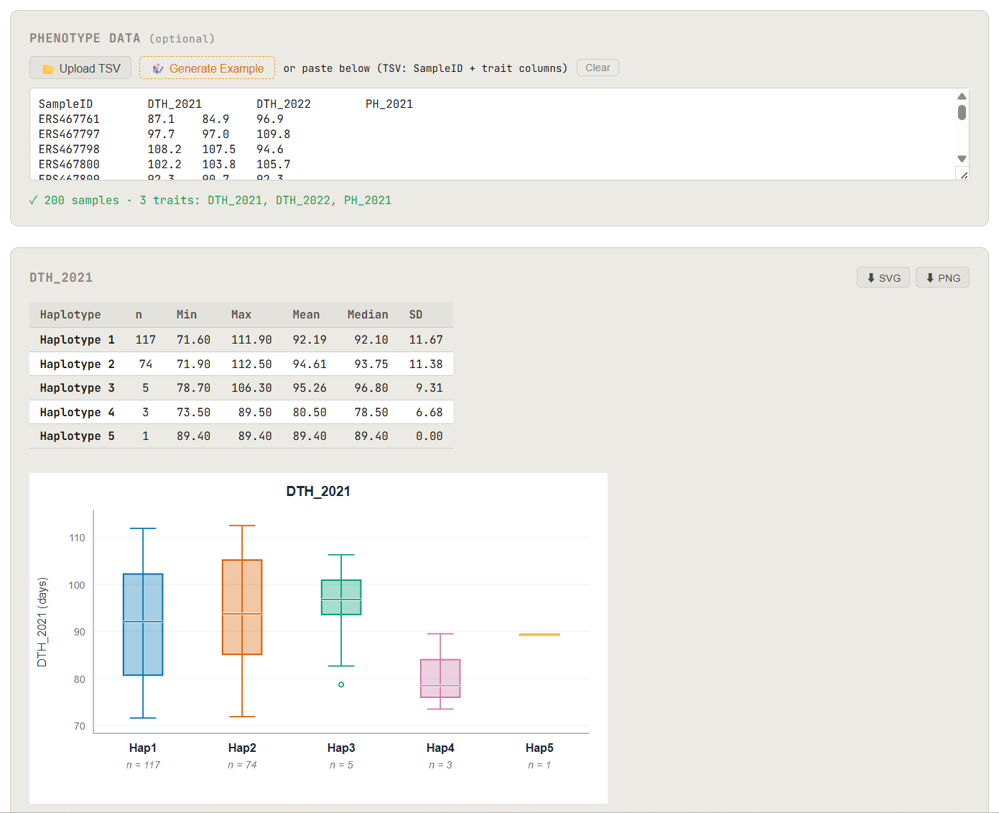

**TSV format:**

The phenotype TSV must be **tab-separated** with the following structure:

```
SampleID    DTH_2021    DTH_2022    PH_2021
ERS467761   87.1        84.9        96.9
ERS467797   97.7        97.0        109.8
ERS467798   108.2       107.5       94.6
ERS467800   102.2       103.8       105.7
...
```

Rules:

- The first column must be **`SampleID`** (matching the IDs used by the
  Genome View, e.g., ERS-prefixed IRRI accession IDs).
- Each subsequent column is one numeric trait. Column names become the
  trait labels in the output (e.g., `DTH_2021`, `PH_2021`).
- Any number of traits is supported — each will produce its own statistics
  table and box plot.
- Missing values can be left blank or marked `NA`; those samples are
  simply excluded from that trait's box plot.

After pasting or uploading, the parser confirms:

```
✓ 200 samples · 3 traits: DTH_2021, DTH_2022, PH_2021
```

**Generating example data:**

Click **`🪄 Generate Example`** to fill the TSV box with a synthetic
200-sample, 3-trait dataset (DTH_2021, DTH_2022, PH_2021). This is the
fastest way to see what HapMatrix produces end-to-end without preparing
your own phenotype file.

**Per-trait summary statistics:**

For each trait, HapMatrix computes:

| Column | Meaning |
|--------|---------|
| Haplotype | Composite haplotype assignment (rank-numbered as in Section 7.3) |
| n | Number of samples in this haplotype with a non-missing trait value |
| Min | Minimum trait value |
| Max | Maximum trait value |
| Mean | Arithmetic mean |
| Median | Median |
| SD | Standard deviation (0.00 when n=1) |

**Box plot:**

Below each statistics table, a box plot displays the trait distribution
per haplotype:

- One **box** per haplotype, color-matched to the genotype table.
- **Whiskers** = 1.5 × IQR, with outliers shown as open circles.
- **Inside line** = median.
- **n labels** below each box show the sample count.
- **Y-axis** is auto-scaled and labeled with the trait name (and unit if
  inferable, e.g., `(days)` for DTH traits).

> **Tip:** The example data shows a clear pattern in `DTH_2021`: Haplotype 4
> (n=3, all `C-C-C`) has the earliest heading at ~80 days, while
> Haplotype 3 (n=5, `A-C-C`) is the latest at ~96 days. This is the
> kind of combinatorial signal that is invisible from any single locus
> analyzed alone — it requires the cross-gene view that HapMatrix provides.

> **Note:** HapMatrix box plots are an exploratory visualization, not a
> statistical test. For confirmatory analysis (ANOVA, Kruskal–Wallis,
> mixed-effects modeling with environment as a random factor), export
> the CSV (Section 7.3) and use R or Python.

**Exporting box plots:**

Each box plot has two download buttons in its top-right corner:

- **`⬇ SVG`** — Vector format, scalable and editable in Illustrator or
  Inkscape. Recommended for publication figures.
- **`⬇ PNG`** — Raster format, suitable for slides, reports, and quick
  sharing.

---

### 7.5 State persistence and resetting

HapMatrix preserves your work as you move around the application. This
section explains exactly what persists, when it is cleared, and how to
share or reproduce an analysis.

**What persists across navigation:**

- All Gene Positions rows (gene, RAP-DB pos, optional end).
- Pasted or uploaded phenotype TSV content.
- Computed haplotype table and box plots (until `Compute Haplotypes` is
  re-run or **`Full Reset`** is clicked).

You can freely switch between the Genome View and HapMatrix, load
different genes, and return to find HapMatrix exactly as you left it.
This makes it natural to build up an analysis incrementally:

1. Open the Genome View for gene A, identify a lead SNP.
2. Go to HapMatrix, add gene A and that SNP coordinate as position #1.
3. Go back to gene B in the Genome View, find another lead SNP.
4. Add gene B as position #2 in HapMatrix.
5. Continue for as many positions as you need.
6. Click **`Compute Haplotypes`** when ready.

**What clears state:**

- **`Full Reset`** (red button) — Clears every Gene Positions row and the
  phenotype TSV after a confirmation prompt. There is no undo.
- **Page reload** (browser refresh) — Clears in-memory HapMatrix state.

> **Warning:** **`Full Reset`** is destructive and not reversible.
> Before clicking it, if you want to keep the current analysis, download
> the haplotype CSV (Section 7.3) and any box plots (Section 7.4) first.

> **Tip:** To share a HapMatrix analysis with a collaborator, send them
> the list of positions (gene + RAP-DB coordinate) plus the phenotype TSV.
> They can reproduce the exact analysis by entering the same positions
> and pasting the TSV — the output is deterministic given identical
> inputs.

---

## 8. BLAST Haplotype Search

BLAST Haplotype Search lets you take any nucleotide sequence — a Sanger
sequencing read, a public database entry, a sequence sent by a collaborator —
and identify which gene, which sample, and which haplotype it matches in the
HapBrowser database. Under the hood, the query is BLASTed against a database
built from per-sample consensus sequences for every registered gene, and
results are returned with both the standard BLAST metrics (identity, score,
e-value) and the corresponding haplotype assignment under your current
classification settings.

Typical use cases:

- Identifying an unknown sequence from sequencing-based genotyping ("what
  gene and what allele is this?").
- Validating that a designed primer or amplicon matches the expected
  haplotype before ordering.
- Cross-checking a sequence from a publication or public database against
  your panel's haplotype catalog.
- Demonstrating the tool quickly to new users via the built-in
  **Mystery Sample** button.

---

### 8.1 Opening BLAST

BLAST is reached from the **`BLAST`** button in the Top Bar (see Section 1 ①).


Click **`BLAST`** to switch the main view to the BLAST Haplotype Search
interface. As with HapMatrix (Section 7), this is a view within the same
single-page application — your gene selection and Control Panel state are
preserved when you return to the Genome View.

---

### 8.2 BLAST interface overview

The BLAST view is intentionally minimal: one query input, one Search button,
and a results panel that appears below after a search completes.

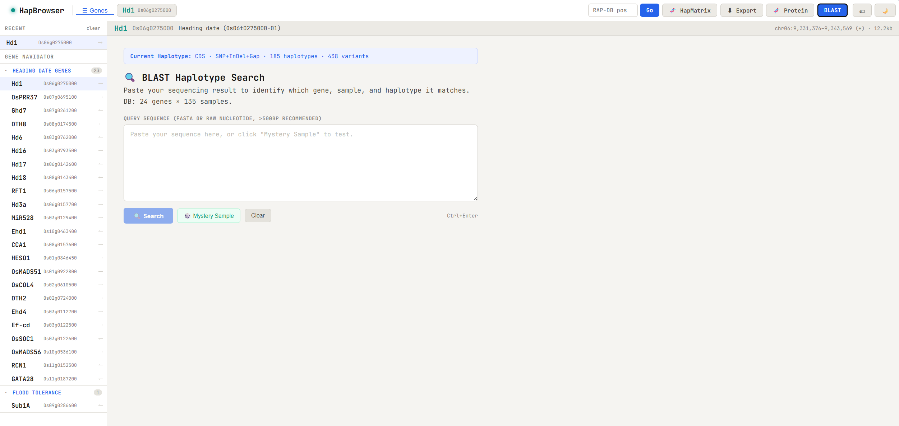

**Interface elements:**

- **Current Haplotype breadcrumb** (top, blue box) — Shows the active
  classification settings inherited from the Genome View, e.g.
  `CDS · SNP+InDel+Gap · 185 haplotypes · 438 variants`. This is both
  informational and functional: the **CDS HAP** column in the results
  (Section 8.4) is computed under exactly these settings, so changing Range
  or Mode in the Control Panel before opening BLAST will change which
  haplotype number a hit is assigned to.
- **Title** — 🔍 **BLAST Haplotype Search**.
- **Description** — One-line summary of what the tool does.
- **Database scope** — `DB: 24 genes × 135 samples`. The database is built
  from per-sample consensus sequences across all registered genes. Only
  samples with sufficient coverage to produce a reliable consensus are
  included, so the BLAST DB sample count may be smaller than the 200-sample
  Genome View panel.
- **QUERY SEQUENCE input** — Large text area accepting FASTA or raw
  nucleotide. The placeholder text recommends sequences ≥ 500 bp for
  reliable identification.
- **Action buttons:**
  * **`Search`** — Submit the query. Disabled until at least one character
    is entered.
  * **`🪄 Mystery Sample`** — Auto-fill the query with a demo sequence so
    you can see the full pipeline output in one click.
  * **`Clear`** — Empty the query box.
- **Keyboard shortcut** — `Ctrl+Enter` submits the search without moving
  your hands from the keyboard.

> **Note:** The 24-gene / 135-sample database is rebuilt whenever new genes
> are added via the Snakemake pipeline (see `USER_GUIDE_ADD_GENES.md`).
> The numbers shown here reflect the current state of the deployed
> instance, which may differ from a fresh demo install.

---

### 8.3 Submitting a query

To run a search, paste your sequence into the query box and click
**`Search`** (or press `Ctrl+Enter`). For a quick demo, click
**`🪄 Mystery Sample`** to auto-fill a known test sequence.

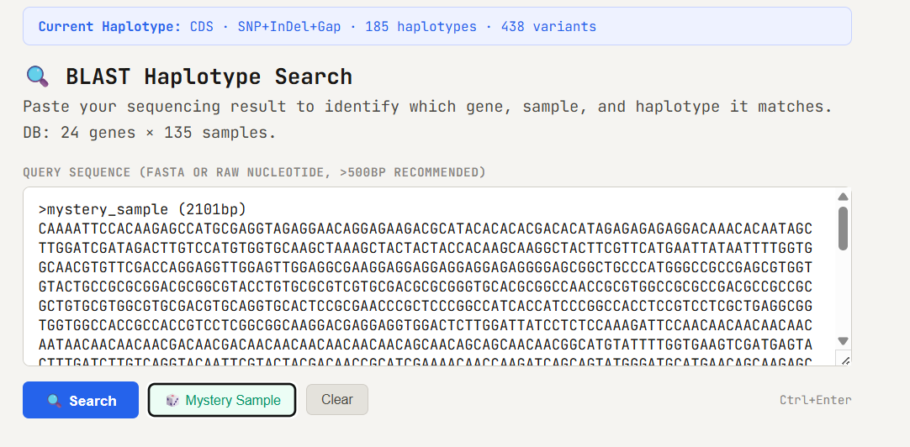

**Accepted input formats:**

- **FASTA** — Standard `>header\nsequence` format. Header is preserved in
  the results display.
- **Raw nucleotide** — Plain sequence without any header. The parser
  accepts this and labels it as an anonymous query.
- **Mixed case** — Upper/lower case bases are both accepted.
- **Whitespace** — Spaces, tabs, and line breaks within the sequence are
  ignored.

In the example above, **`Mystery Sample`** has loaded a 2,101 bp sequence
with the FASTA header `>mystery_sample (2101bp)`. The button itself is
outlined to indicate it was just clicked.

**Length recommendations:**

| Query length | Reliability |
|--------------|-------------|
| < 100 bp | Possible but ambiguous — many short matches in a 24-gene DB |
| 100–500 bp | Usually identifies the correct gene; sample-level assignment may be uncertain |
| **≥ 500 bp** (recommended) | Reliable gene + sample + haplotype identification |
| 1–3 kb (typical Sanger or amplicon) | Optimal — full-gene resolution |

> **Tip:** If you only have a short read (< 200 bp) and the result is
> ambiguous, try concatenating multiple reads from the same sample, or use
> the longer read as a query and treat the result as a hypothesis to verify
> in the Genome View.

---

### 8.4 Reading the results

After clicking **`Search`**, results appear below the query box. The top of
the results section is dominated by a green **Answer** box that summarizes
the best hit, followed by a sortable table of all hits.

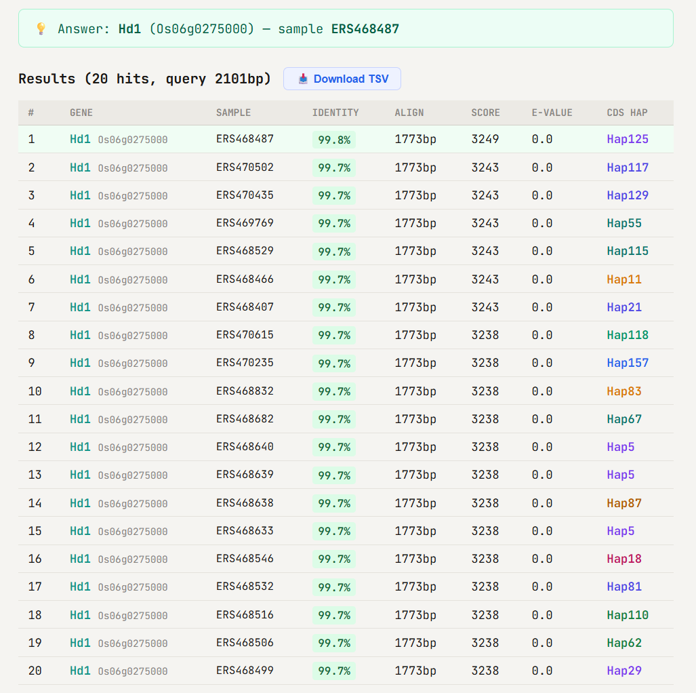

#### Answer box

The green callout at the top of the results gives the single most likely
identity of your query:

```
💡 Answer: Hd1 (Os06g0275000) — sample ERS468487
```

This is the top-scoring hit by BLAST score and identity, presented as a
plain-language one-liner. In most cases, this is the only line you need to
read — the table below is for verifying, exploring nearby hits, and
exporting.

#### Results table

Below the Answer box, the full hit list is shown:

```
Results (20 hits, query 2101bp)    [⬇ Download TSV]
```

| Column | Meaning |
|--------|---------|
| `#` | Hit rank (1 = best by score) |
| `GENE` | Gene symbol + RAP-DB ID of the matched gene |
| `SAMPLE` | Sample ID (e.g., `ERS468487`) whose consensus produced the hit |
| `IDENTITY` | Percent identity over the aligned region, color-coded as a green pill |
| `ALIGN` | Aligned length in bp |
| `SCORE` | Raw BLAST bit score |
| `E-VALUE` | Expectation value (`0.0` indicates a perfect or near-perfect match) |
| `CDS HAP` | Haplotype assignment for this sample under the **current
classification settings** shown in the breadcrumb at the top |

In the example above, all 20 top hits map to *Hd1* with > 99.7% identity,
e-values of 0.0, and a 1,773 bp alignment (the full Hd1 CDS length in this
demo).

**CDS HAP column color coding:**

Each haplotype number is color-coded to match the same haplotype's color
in the Genome View. Multiple hits with the same color carry the same
classification haplotype — for example, three of the hits above are
`Hap5` (purple), meaning those three samples share an identical CDS
haplotype even though they are listed as separate hits because the BLAST
DB has one entry per sample.

> **Tip:** Click any haplotype number (`Hap5`, `Hap125`, ...) is a future
> enhancement. For now, to inspect a hit's full haplotype in the Genome
> View, copy the gene symbol from the `GENE` column, return to the
> Genome View, load that gene from the sidebar, and look up the sample ID
> in the haplotype matrix.

#### Download TSV

The **`⬇ Download TSV`** button (top-right of the results table) exports a
tab-separated file with the same eight columns shown in the table. This is
convenient for:

- Filtering or re-sorting hits in R, Python, or Excel.
- Building a manual genotype table by querying multiple sequences in
  succession and concatenating the TSVs.
- Sharing identification results with collaborators in a format compatible
  with any spreadsheet tool.

> **Note:** The BLAST search runs locally against the HapBrowser instance's
> precomputed database — no data is sent to NCBI or any external service.
> This means your query sequences stay private and the search is fast even
> for ~2 kb queries (typically < 1 second).

---

## 9. Sample Variety Names

Sample IDs like `ERS467761` are unambiguous but hard to remember and hard
to interpret at a glance. HapBrowser lets you attach a human-readable
**variety / cultivar name** to each sample ID — for example, mapping
`ERS467761` to `IRIS 313-11973` — and the names appear inline alongside
the sample IDs in every view. This is purely a display layer: classification,
BLAST hits, and exports continue to use the underlying sample IDs.

---

### 9.1 Opening Sample varieties

Click the **🏷 tag icon** in the Top Bar (right side, next to the BLAST
button) to open the Sample varieties modal.

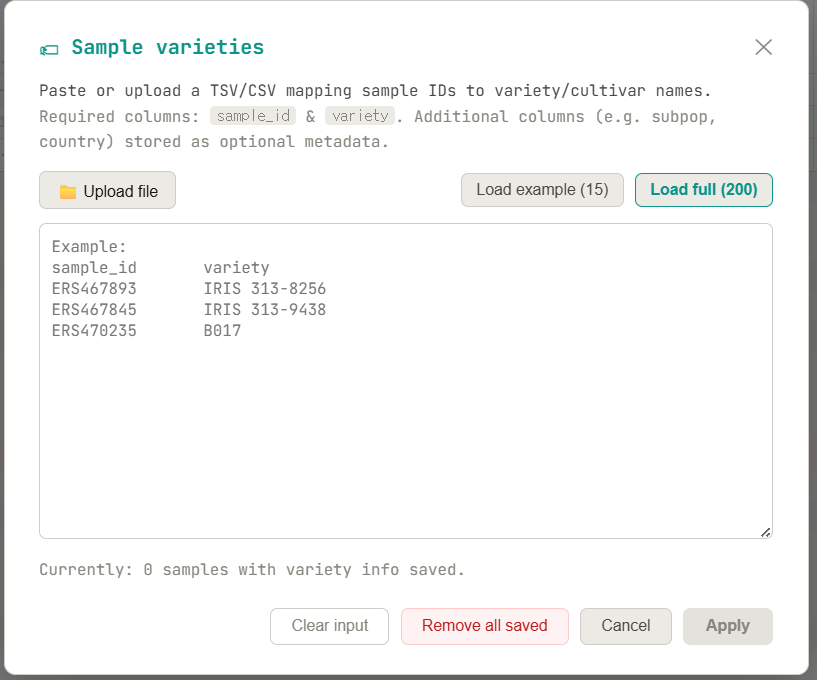

**Modal anatomy:**

- **Header** — 🏷 **Sample varieties** with an `×` close button.
- **Description** — Required and optional column rules.
- **Upload file** — Choose a `.tsv` or `.csv` file from disk.
- **Load example (15)** — Fill the input with a 15-row demo mapping.
- **Load full (200)** — Fill the input with the full 200-sample mapping
  that ships with HapBrowser (IRIS-ID names for every demo accession).
- **Paste box** — Text area for direct paste; shows an example placeholder
  when empty.
- **Status line** — `Currently: N samples with variety info saved`
  reflects how many mappings are currently persisted.
- **Action buttons** — `Clear input` / `Remove all saved` (destructive) /
  `Cancel` / `Apply`.

---

### 9.2 Mapping file format

The mapping is a tab- or comma-separated table with the following columns:

| Column | Required | Description |
|--------|----------|-------------|
| `sample_id` | **Yes** | Must match the sample IDs used in the Genome View (e.g., `ERS467893`) |
| `variety` | **Yes** | Human-readable name (e.g., `IRIS 313-8256`, `B017`, `Nipponbare`) |
| `subpop`, `country`, ... | No | Any extra columns are kept as optional metadata |

Example (tab-separated):

```
sample_id    variety
ERS467893    IRIS 313-8256
ERS467845    IRIS 313-9438
ERS470235    B017
```

The parser is lenient — both TSV and CSV work, and the column order does
not matter as long as the two required columns are named correctly. Any
unknown sample IDs in the file are silently ignored.

> **Tip:** **Load full (200)** is the fastest way to get started: it
> populates the input with the IRIS-ID mapping for every IRRI accession
> in the demo panel. After loading, click **Apply** and the names appear
> across the entire interface.

---

### 9.3 Applying a mapping

After loading or pasting, a green confirmation appears under the input:

```
✓ 200 samples parsed
```

The **Apply** button activates (turns blue). Click it to commit the
mapping — the modal closes, and variety names appear immediately under
every sample ID in the Genome View, Sample Filter list, BLAST results,
and any other panel that displays sample IDs.

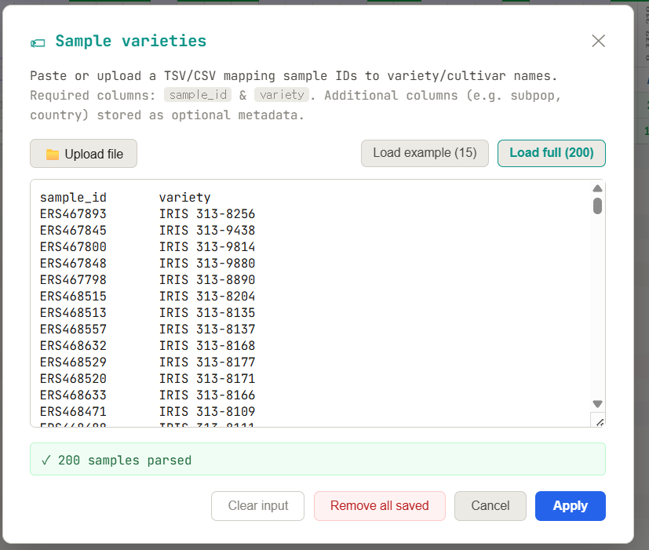

The effect is visible immediately in the Sample Filter list and the
Genome View — each ERS ID gets a second line with the variety name in a
smaller, muted font:

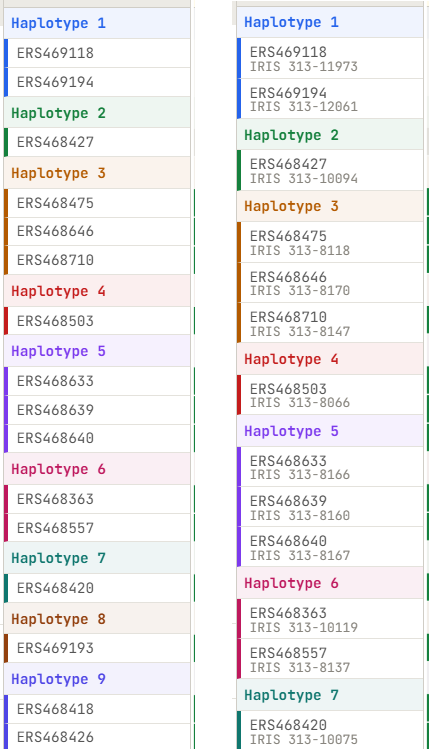

The variety name is purely a display addition. The sample ID remains the
primary identifier in CSV exports, BLAST result TSVs, and all internal
operations.

---

### 9.4 Managing saved mappings

Mappings persist across page reloads, so applying once is enough — the
names remain after a browser refresh or after navigating between
HapBrowser views.

The bottom row of the modal provides four actions:

| Button | Behavior |
|--------|----------|
| **Clear input** | Empty the text area only; previously applied mappings stay in effect |
| **Remove all saved** | Delete every saved mapping; sample IDs revert to ERS-only display |
| **Cancel** | Close the modal without saving changes |
| **Apply** | Save the current input and update the display |

> **Note:** **Remove all saved** is the only way to fully un-map; clicking
> **Apply** with an empty input does not erase existing mappings (it
> simply applies an empty addition).

> **Tip:** If you work with a custom panel (not the IRRI 200), prepare
> your own `sample_id <TAB> variety` file and use **Upload file** to
> load it. The "varieties" column is free-form text — any meaningful
> label (line name, registration code, breeding code) works.

---
